# dbx-dash: Technical Architecture

## Overview

`dbx-dash` is a terminal dashboard for Databricks workspaces, written in Go.
It provides live visibility into jobs, clusters, SQL warehouses, DLT pipelines,
workspace identity (users, groups, service principals), and Unity Catalog objects
across multiple workspaces.

## Tech Stack

| Layer | Library |
|---|---|
| TUI framework | `github.com/charmbracelet/bubbletea` v1.2.4 |
| Styling | `github.com/charmbracelet/lipgloss` v1.0.0 |
| Widgets | `github.com/charmbracelet/bubbles` v0.20.0 |
| Databricks API | `github.com/databricks/databricks-sdk-go` v0.55.0 |
| CLI | `github.com/spf13/cobra` |
| Config (INI) | `gopkg.in/ini.v1` |
| Config (TOML) | `github.com/BurntSushi/toml` |
| Cache (SQLite) | `modernc.org/sqlite` (pure Go, no CGO) |

## Project Structure

```
dbx-dash/
├── cmd/
│   └── dbx-dash/
│       └── main.go                   # cobra CLI entrypoint
├── internal/
│   ├── config/
│   │   ├── model.go                  # WorkspaceProfile, AppConfig, RefreshConfig
│   │   └── loader.go                 # merge ~/.databrickscfg (INI) + ~/.dbx-dash/config.toml
│   ├── databricks/
│   │   ├── interfaces.go             # provider interfaces (JobsProvider, CatalogProvider, etc.)
│   │   ├── models.go                 # domain types (Job, Cluster, ObjectDetail, GrantEntry, etc.)
│   │   ├── sdk/
│   │   │   ├── factory.go            # WorkspaceClientFactory (lazy init, per-profile cache)
│   │   │   ├── jobs.go               # SDKJobsProvider
│   │   │   ├── clusters.go           # SDKClustersProvider
│   │   │   ├── warehouses.go         # SDKWarehousesProvider
│   │   │   ├── pipelines.go          # SDKPipelinesProvider
│   │   │   ├── identity.go           # SDKIdentityProvider
│   │   │   └── catalogs.go           # SDKCatalogProvider (list + GetObjectDetail)
│   │   └── mock/
│   │       └── providers.go          # in-memory mocks for unit tests
│   ├── cache/
│   │   ├── db.go                     # SQLite init, incremental schema migrations (v1→v2)
│   │   └── repository.go             # UpsertJob/GetJobs, UpsertCluster/GetClusters,
│   │                                 #   UpsertIdentity/GetIdentityGroups
│   ├── tui/
│   │   ├── app.go                    # root Bubble Tea model (Update/View/Init)
│   │   ├── keys.go                   # global key bindings
│   │   ├── styles.go                 # shared lipgloss styles
│   │   └── screens/
│   │       ├── dashboard.go          # workspace health summary cards
│   │       ├── jobs.go               # sortable jobs + recent runs table
│   │       ├── clusters.go           # clusters table
│   │       ├── warehouses.go         # SQL warehouses table
│   │       ├── run_detail.go         # job run detail + log viewport
│   │       ├── identity.go           # identity tree + detail popup
│   │       └── catalog.go            # UC catalog tree, filter, split layout + detail panel
│   └── alerts/
│       └── terminal.go               # RingBell(), FlashAlert()
├── docs/
│   └── architecture.md               # this file
├── go.mod
└── README.md
```

---

## Architecture Diagram

```mermaid
graph TB
    subgraph External["External / Platform"]
        DBX["☁️  Databricks Workspace\n(REST APIs)"]
        CFG_FILE["~/.databrickscfg\nor env vars\n(auth tokens / OAuth)"]
        TOML["~/.dbx-dash/config.toml\n(workspaces, refresh,\njobs_age_days)"]
        SQLITE["~/.dbx-dash/cache.db\nSQLite (WAL mode)\njob_snapshots\ncluster_snapshots\nidentity_cache"]
    end

    subgraph SDK_LIB["databricks-sdk-go v0.55.0"]
        WC["WorkspaceClient\n(Jobs · Clusters · Warehouses\nPipelines · Schemas · Tables\nCatalogs · Grants · SCIM)"]
    end

    subgraph Config["internal/config"]
        AppConfig["AppConfig\n  Workspaces[]\n  Refresh\n  JobsAgeDays"]
        WorkspaceProfile["WorkspaceProfile\n  Name · Host\n  Token / OAuth"]
    end

    subgraph DB["internal/databricks  (domain layer)"]
        Models["models.go\n  Job · JobRun · RunOutput\n  Cluster · SqlWarehouse\n  Pipeline · PipelineUpdate\n  Group · IdentityUser\n  WorkspaceServicePrincipal\n  UserDetail · SPDetail\n  CatalogInfo · SchemaInfo\n  TableInfo · GrantEntry\n  ObjectDetail"]

        subgraph Ifaces["interfaces.go"]
            JP["JobsProvider"]
            CP["ClustersProvider"]
            WP["WarehousesProvider"]
            PP["PipelinesProvider"]
            IP["IdentityProvider"]
            CAP["CatalogProvider"]
        end

        WPS["WorkspaceProviders\n  Jobs · Clusters · Warehouses\n  Pipelines · Identity · Catalog"]
    end

    subgraph SDKImpl["internal/databricks/sdk  (SDK implementations)"]
        SDKF["WorkspaceClientFactory\n  GetProviders(profile)\n  ValidateAuth(ctx,profile)"]
        SDKJobs["SDKJobsProvider"]
        SDKClusters["SDKClustersProvider"]
        SDKWh["SDKWarehousesProvider"]
        SDKPipes["SDKPipelinesProvider"]
        SDKId["SDKIdentityProvider"]
        SDKCat["SDKCatalogProvider\n  GetObjectDetail → metadata\n  + grants hierarchy"]
    end

    subgraph MockImpl["internal/databricks/mock"]
        MockProv["Mock providers\n  (test use only)"]
    end

    subgraph CacheLayer["internal/cache"]
        CacheDB["db.go\n  Open(path) — WAL SQLite\n  migrate() v1→v2"]
        CacheRepo["Repository\n  UpsertJob / GetJobs\n  UpsertCluster / GetClusters\n  UpsertIdentity / GetIdentityGroups"]
    end

    subgraph TUI["internal/tui"]
        App["app.go  (root Model)\n  wsIdx · screen\n  loadDashboard()\n  loadJobs()\n  loadClusters()\n  loadWarehouses()\n  loadAllIdentity()\n  loadCatalogs()\n  refreshCurrentScreen()"]

        subgraph Screens["internal/tui/screens"]
            Dash["DashboardModel"]
            Jobs["JobsModel"]
            Clust["ClustersModel"]
            Wh["WarehousesModel"]
            Ident["IdentityModel\n  users · groups · SPs\n  popup detail\n  catalog permissions"]
            RunD["RunDetailModel"]
            Cat["CatalogModel\n  tree (catalog→schema→table)\n  / filter (textinput)\n  40%% tree | 60%% detail\n  expandGrants() bi-dir\n  detailVP (viewport)"]
        end
    end

    TOML --> AppConfig
    CFG_FILE --> SDKF
    AppConfig --> SDKF
    WorkspaceProfile --> SDKF
    SDKF --> WC
    WC --> DBX
    SDKF -->|GetProviders| WPS
    SDKJobs --> JP
    SDKClusters --> CP
    SDKWh --> WP
    SDKPipes --> PP
    SDKId --> IP
    SDKCat --> CAP
    WPS --> JP & CP & WP & PP & IP & CAP
    JP & CP & WP & PP & IP & CAP --> Models
    MockProv -.->|implements| JP & CP & WP & PP & IP & CAP
    AppConfig --> App
    WPS --> App
    CacheRepo --> App
    App --> Dash & Jobs & Clust & Wh & Ident & RunD & Cat
    CacheDB --> CacheRepo
    SQLITE --> CacheDB
    App -->|UpsertIdentity on IdentityLoadedMsg| CacheRepo
    App -->|UpsertJob / UpsertCluster| CacheRepo
    Cat -->|CatalogObjectDetailRequestMsg| App
    App -->|LoadCatalogObjectDetailCmd| SDKCat
    SDKCat -->|CatalogObjectDetailLoadedMsg| Cat
    App -->|IdentityLoadedMsg groups| Cat
```



---

## Data Layer: Provider Interfaces

All Databricks API calls go through provider interfaces defined in
`internal/databricks/interfaces.go`. This allows the SDK implementation to be
swapped for mocks in tests, or a future REST implementation.

```go
type JobsProvider interface {
    ListJobs(ctx context.Context, limit int) ([]Job, error)
    GetJob(ctx context.Context, jobID int64) (*Job, error)
    ListRecentRuns(ctx context.Context, jobID int64, limit int) ([]JobRun, error)
    GetRunOutput(ctx context.Context, runID int64) (*RunOutput, error)
}

type ClustersProvider interface {
    ListClusters(ctx context.Context) ([]Cluster, error)
    GetCluster(ctx context.Context, clusterID string) (*Cluster, error)
}

type WarehousesProvider interface {
    ListWarehouses(ctx context.Context) ([]SqlWarehouse, error)
    GetWarehouse(ctx context.Context, warehouseID string) (*SqlWarehouse, error)
}

type PipelinesProvider interface {
    ListPipelines(ctx context.Context) ([]Pipeline, error)
    GetPipeline(ctx context.Context, pipelineID string) (*Pipeline, error)
    ListPipelineUpdates(ctx context.Context, pipelineID string, limit int) ([]PipelineUpdate, error)
}

type IdentityProvider interface {
    ListGroups(ctx context.Context) ([]Group, error)
    ListUsers(ctx context.Context) ([]IdentityUser, error)
    ListServicePrincipals(ctx context.Context) ([]WorkspaceServicePrincipal, error)
    GetUser(ctx context.Context, userID string) (*UserDetail, error)
    GetServicePrincipal(ctx context.Context, spID string) (*SPDetail, error)
    GetCatalogPermissions(ctx context.Context, principalName string) ([]CatalogPermission, error)
    GetSPPermissions(ctx context.Context, spID string) ([]SPAccessEntry, error)
}

type CatalogProvider interface {
    ListCatalogs(ctx context.Context) ([]CatalogInfo, error)
    ListSchemas(ctx context.Context, catalogName string) ([]SchemaInfo, error)
    ListTables(ctx context.Context, catalogName, schemaName string) ([]TableInfo, error)
    GetObjectDetail(ctx context.Context, kind, fullName string) (*ObjectDetail, error)
}
```

All providers are bundled per workspace in `WorkspaceProviders`.

---

## Domain Models

Key types in `internal/databricks/models.go`:

| Type | Description |
|---|---|
| `Job` | Databricks job definition |
| `JobRun` | Single job execution with state/result |
| `RunOutput` | Logs and error output for a completed run |
| `Cluster` | All-purpose or job cluster |
| `SqlWarehouse` | SQL warehouse (serverless or classic) |
| `Pipeline` | Delta Live Tables pipeline |
| `PipelineUpdate` | Single DLT pipeline update run |
| `Group` | Workspace SCIM group with members |
| `GroupMember` | Member of a group (user, group, or SP) |
| `IdentityUser` | Workspace SCIM user (summary) |
| `WorkspaceServicePrincipal` | Workspace service principal (summary) |
| `UserDetail` | Full SCIM user including entitlements, groups, roles, catalog permissions |
| `SPDetail` | Full SCIM service principal including entitlements, groups, roles |
| `CatalogInfo` | Unity Catalog catalog (name, comment, owner) |
| `SchemaInfo` | Unity Catalog schema (fullName, catalogName, owner) |
| `TableInfo` | Unity Catalog table or view |
| `GrantEntry` | Single principal's direct grant on a UC securable |
| `ObjectDetail` | Full metadata + 3-level grants hierarchy for a catalog/schema/table |

### ObjectDetail

Used by the catalog detail panel. Grants are stored at three levels:

```
ObjectDetail
├── Kind            string          // "catalog", "schema", "table"
├── FullName        string
├── Owner           string
├── Comment         string
├── StorageLocation string
├── DataFormat      string          // DELTA, PARQUET, CSV, … (tables)
├── TableType       string          // TABLE, VIEW, MATERIALIZED_VIEW, …
├── CreatedAt       time.Time
├── UpdatedAt       time.Time
├── DirectGrants    []GrantEntry    // grants on this object
├── ParentGrants    []GrantEntry    // schema grants (tables only)
└── GrandpaGrants   []GrantEntry    // catalog grants (tables + schemas)
```

---

## SDK Implementation

`internal/databricks/sdk/` wraps `databricks-sdk-go` v0.55.0.

**SDK limits (enforced in code):**
- `ListJobs`: max page size 100
- `ListRuns`: max page size 24

`WorkspaceClientFactory` creates one `*databricks.WorkspaceClient` per profile name,
lazily on first use, protected by a `sync.Mutex`. Auth: PAT token or OAuth M2M via
`databricks.Config{Host, Token, ClientID, ClientSecret}`.

### Catalog provider

`SDKCatalogProvider.GetObjectDetail` dispatches on `kind`:

| Kind | Metadata API | Grants fetched |
|---|---|---|
| `catalog` | `Catalogs.GetByName` | `Grants.Get(SecurableTypeCatalog, name)` |
| `schema` | `Schemas.GetByFullName` | schema + parent catalog grants |
| `table` | `Tables.GetByFullName` | table + parent schema + grandparent catalog grants |

Grants use `Grants.GetBySecurableTypeAndFullName` (direct grants only).
Transitive expansion is done client-side using the pre-fetched group hierarchy
(see **Catalog Screen** below). Permission errors from `Grants.Get` are non-fatal
— the grants section renders gracefully without one level rather than erroring.

### Identity provider

SCIM APIs used:
- `w.Groups.ListAll` with `Attributes:"id,displayName,members"` (list view)
- `w.Users.ListAll` with `Attributes:"id,userName,displayName,active"` (list view)
- `w.ServicePrincipals.ListAll` with `Attributes:"id,applicationId,displayName,active"` (list view)
- `w.Users.Get` / `w.ServicePrincipals.Get` (full SCIM detail for popup)
- `w.Catalogs.ListAll` + `w.Grants.GetEffective` per catalog (principal-filtered UC permissions)

---

## TUI Architecture

The app uses the Elm-like Bubble Tea pattern: a root `Model` holds all screen
sub-models and routes messages.

### Root Model (`internal/tui/app.go`)

```
Model
├── screen      screenID           (current active screen)
├── wsIdx       int                (current workspace index)
├── providers   map[string]*WorkspaceProviders
├── cacheRepo   *cache.Repository
├── wsDataMode  map[string]string  // "live" | "cached" per workspace
├── dashboard   DashboardModel
├── jobs        JobsModel
├── clusters    ClustersModel
├── warehouses  WarehousesModel
├── identity    IdentityModel
├── runDetail   RunDetailModel
└── catalogs    CatalogModel
```

### Async Data Loading

Data is fetched asynchronously via `tea.Cmd`. The root model fans load commands
out across workspaces via `tea.Batch`. Screen models never call providers directly;
instead they emit **request messages** that the root model intercepts:

```
Screen emits XxxRequestMsg
  → app.Update catches it
  → fires LoadXxxCmd(ctx, workspace, provider)
  → XxxLoadedMsg arrives back
  → app.Update routes to screen model
```

Example — catalog object detail:
1. User presses `→` on a catalog tree node.
2. `CatalogModel.Update` returns `CatalogObjectDetailRequestMsg{Workspace, Kind, FullName}`.
3. `app.go` catches it, fires `screens.LoadCatalogObjectDetailCmd(ctx, ws, kind, fullName, p.Catalog)`.
4. `CatalogObjectDetailLoadedMsg` is always forwarded to `CatalogModel` regardless of active screen.
5. Catalog screen renders the detail panel with metadata + expanded grants.

### Identity pre-fetch and catalog grants expansion

The group hierarchy is fetched eagerly for all workspaces:
- At `Init()` — `loadAllIdentity()` runs in parallel with dashboard load.
- On every auto-refresh tick.
- On manual `r` refresh.

Results are cached in SQLite (`identity_cache` table) via `UpsertIdentity`.
`IdentityLoadedMsg` is always forwarded to `CatalogModel`, which stores the
groups and uses them in `expandGrants()` for client-side transitive permission
expansion.

`expandGrants()` does **bi-directional** expansion:
- **Downward** (members): for each group principal with a grant, show all members of that group.
- **Upward** (parents): for each group principal with a grant, show parent groups that contain it.
Both directions are capped at depth 4 to prevent infinite loops.

### Key Bindings (global)

| Key | Action |
|---|---|
| `1` | Dashboard |
| `2` | Jobs |
| `3` | Clusters |
| `4` | Warehouses |
| `5` | Identity |
| `6` | Catalogs |
| `r` | Refresh current screen |
| `w` | Next workspace |
| `enter` | Select / drill-down |
| `esc` / `b` | Back |
| `q` | Quit |

Global keys are suppressed when the identity search box or popup is active,
or when the catalog filter (`/`) is active.

---

## Catalog Screen

The catalog screen (`internal/tui/screens/catalog.go`) shows a Unity Catalog
tree with a side-by-side detail panel.

### Layout

```
┌─ tree (40%) ──────────┬─ detail (60%) ─────────────────────────────┐
│ / filter:             │  my_catalog.my_schema.my_table  [TABLE]    │
│  ▼ my_catalog         │                                             │
│    ├─ ▼ my_schema     │  Owner:    alice@co.com                     │
│    │    ├─ my_table   │  Format:   DELTA                            │
│    │    └─ view1      │  Storage:  abfss://…                        │
│    └─ other_schema    │  Created:  2024-01-15                       │
│                       │                                             │
│                       │  ── Table grants ─────────────────────────  │
│                       │  alice@co.com         SELECT, MODIFY        │
│                       │  admins (group)       SELECT                │
│                       │  ── Schema grants ──── (inherited) ───────  │
│                       │  data-team (group)    USE_SCHEMA            │
│                       │  ── Catalog grants ─── (inherited) ───────  │
│                       │  admins (group)       USE_CATALOG           │
└───────────────────────┴─────────────────────────────────────────────┘
  ↑/↓ navigate  → detail  enter expand/collapse  / filter  esc clear
```

### Key bindings (catalog screen)

| Key | Action |
|---|---|
| `↑` / `↓` | Navigate tree |
| `enter` | Expand / collapse catalog or schema |
| `→` | Load full detail for selected node |
| `/` | Activate filter input |
| `enter` (in filter) | Confirm filter, return focus to tree |
| `esc` (in filter) | Clear filter |
| `w` | Switch workspace (resets tree) |

### Filter

Two-pass filter: pass 1 collects catalogs/schemas that have at least one
matching descendant; pass 2 emits only items that match or are ancestors of
a match. Case-insensitive substring match on display name.

---

## Identity Screen

The identity screen renders a per-workspace tree:

```
▼ production-workspace
    GROUPS (12)
    ▼ admins (3)
       ├ alice@example.com   [user]
       ├ bob@example.com     [user]
       └ etl-bot             [sp]
    ► data-engineers (7)
    USERS (45)
       alice@example.com
       bob@example.com  <bob.smith@example.com>
    SERVICE PRINCIPALS (3)
       etl-bot  app:1234567890
```

- `/` opens search filter
- `enter` on a workspace or group: expand/collapse
- `enter` on a user or SP: open detail popup

**Detail popup** sections:

| Section | Content |
|---|---|
| Header | Username/name, SCIM ID, active status |
| WORKSPACE ENTITLEMENTS | Direct entitlements on the workspace |
| ROLES | Workspace roles (admin/user) |
| GROUP MEMBERSHIPS | Direct groups (●) and transitive/inherited groups (◌) |
| UNITY CATALOG PERMISSIONS | Per-catalog privileges; "not available" if UC is disabled |

Transitive group membership is computed client-side via BFS on the reverse
membership map. No additional API calls are needed.

---

## Config

Configuration is loaded from two sources merged at startup:

1. `~/.databrickscfg` (INI): workspace profiles with auth credentials
2. `~/.dbx-dash/config.toml` (optional overlay): display names, refresh intervals

```toml
[refresh]
default_interval = 30

[jobs]
age_days = 7

[workspace.production]
display_name = "Prod"
refresh_interval = 60
```

Auth types supported: PAT (`token =`), OAuth M2M (`client_id` + `client_secret`).

---

## Cache

SQLite via `modernc.org/sqlite` (pure Go, no CGO, portable across platforms).
Schema versioned via `PRAGMA user_version`. Migrations applied incrementally.

| Version | Tables added |
|---|---|
| v1 | `job_snapshots`, `cluster_snapshots` |
| v2 | `identity_cache` (groups JSON blob per workspace) |

The cache enables **offline / cached mode**: if a live API call fails,
the app falls back to the most recent snapshot and shows a "Cached" badge
in the workspace header.

---

## Build

```bash
go build -o dbx-dash ./cmd/dbx-dash
./dbx-dash run
./dbx-dash config list
./dbx-dash config check <workspace>
```

The binary is self-contained. No CGO required. `go build` produces a static
binary that runs on Linux, macOS, and Windows without any system dependencies.
Terminal rendering uses standard ANSI escape codes via lipgloss/bubbletea.
